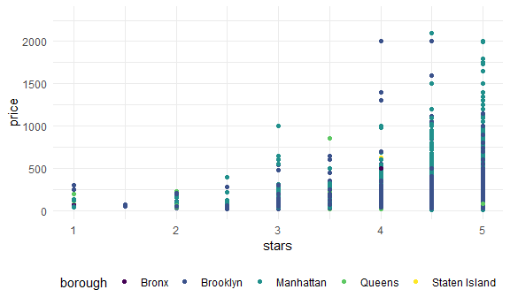
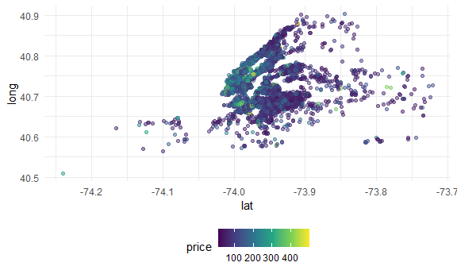

Case Study 1
================
Rose Killian

### Loading libraries and data

``` r
library(tidyverse)
```

    ## -- Attaching packages --------------------------------------- tidyverse 1.3.1 --

    ## v ggplot2 3.3.5     v purrr   0.3.4
    ## v tibble  3.1.4     v dplyr   1.0.7
    ## v tidyr   1.1.3     v stringr 1.4.0
    ## v readr   2.0.1     v forcats 0.5.1

    ## -- Conflicts ------------------------------------------ tidyverse_conflicts() --
    ## x dplyr::filter() masks stats::filter()
    ## x dplyr::lag()    masks stats::lag()

``` r
knitr::opts_chunk$set(
  fig.width = 6,
  fig.asp = .6,
  out.width = "90%"
)

theme_set(theme_minimal() + theme(legend.position = "bottom"))

options(
  ggplot2.continuous.colour = "viridis",
  ggplot2.continuous.fill = "viridis"
)

scale_colour_discrete = scale_colour_viridis_d
scale_fill_discrete = scale_fill_viridis_d

library(p8105.datasets)
```

## Load a data set

``` r
data(nyc_airbnb)
```

*How many rentals are there? Of what type? In what places? *Is price
correlated with review score? *Which neighborhood is most popular? Most
expensive? *Which neighborhood has the highest reviews? *Is availability
related to price? Is room type related to neighborhood? *Is length of
stay related to neighborhood group?

``` r
nyc_airbnb = 
  nyc_airbnb %>% 
  mutate(stars = review_scores_location / 2) %>% 
  rename(borough = neighbourhood_group)
```

so let’s count things

``` r
nyc_airbnb %>% 
  janitor::tabyl(borough, room_type)
```

    ##        borough Entire home/apt Private room Shared room
    ##          Bronx             192          429          28
    ##       Brooklyn            7427         9000         383
    ##      Manhattan           10814         7812         586
    ##         Queens            1388         2241         192
    ##  Staten Island             116          144           1

``` r
nyc_airbnb %>% 
  count(borough, room_type)
```

    ## # A tibble: 15 x 3
    ##    borough       room_type           n
    ##    <chr>         <chr>           <int>
    ##  1 Bronx         Entire home/apt   192
    ##  2 Bronx         Private room      429
    ##  3 Bronx         Shared room        28
    ##  4 Brooklyn      Entire home/apt  7427
    ##  5 Brooklyn      Private room     9000
    ##  6 Brooklyn      Shared room       383
    ##  7 Manhattan     Entire home/apt 10814
    ##  8 Manhattan     Private room     7812
    ##  9 Manhattan     Shared room       586
    ## 10 Queens        Entire home/apt  1388
    ## 11 Queens        Private room     2241
    ## 12 Queens        Shared room       192
    ## 13 Staten Island Entire home/apt   116
    ## 14 Staten Island Private room      144
    ## 15 Staten Island Shared room         1

``` r
range(pull(nyc_airbnb, stars), na.rm = T)
```

    ## [1] 1 5

``` r
nyc_airbnb %>% 
  filter(stars == 1)
```

    ## # A tibble: 21 x 18
    ##         id review_scores_l~ name   host_id host_name borough neighbourhood   lat
    ##      <dbl>            <dbl> <chr>    <dbl> <chr>     <chr>   <chr>         <dbl>
    ##  1  6.94e6                2 Share~  3.64e7 Vinayaka  Queens  Ozone Park    -73.8
    ##  2  1.27e6                2 1 Bed~  2.25e6 Nerenda   Brookl~ Bedford-Stuy~ -73.9
    ##  3  3.69e6                2 THE B~  1.77e7 Arleta    Brookl~ Bedford-Stuy~ -73.9
    ##  4  1.28e7                2 Cozy ~  5.51e7 Meifang   Brookl~ Borough Park  -74.0
    ##  5  1.74e7                2 Beaut~  1.18e8 Monique ~ Brookl~ Brownsville   -73.9
    ##  6  9.13e6                2 Priva~  1.75e7 Marco     Brookl~ Bushwick      -73.9
    ##  7  9.15e6                2 Beaut~  4.76e7 Colin     Brookl~ Bushwick      -73.9
    ##  8  1.80e7                2 Moder~  1.23e8 Jason     Brookl~ Clinton Hill  -74.0
    ##  9  1.63e7                2 Comfo~  4.26e7 Carla     Brookl~ East New York -73.9
    ## 10  1.70e7                2 Luxur~  1.52e6 Bharat    Manhat~ Financial Di~ -74.0
    ## # ... with 11 more rows, and 10 more variables: long <dbl>, room_type <chr>,
    ## #   price <dbl>, minimum_nights <dbl>, number_of_reviews <dbl>,
    ## #   last_review <date>, reviews_per_month <dbl>,
    ## #   calculated_host_listings_count <dbl>, availability_365 <dbl>, stars <dbl>

``` r
nyc_airbnb %>% 
  ggplot(aes(x = price, y = stars, color = borough)) +
  geom_point()
```

    ## Warning: Removed 10037 rows containing missing values (geom_point).


``` r
nyc_airbnb %>% 
  filter(price < 2500) %>% 
  ggplot(aes(x = price, y = stars, color = borough)) +
  geom_point()
```

    ## Warning: Removed 10017 rows containing missing values (geom_point).


``` r
nyc_airbnb %>% 
  filter(price < 2500) %>% 
  ggplot(aes(x = stars, y = price, color = borough)) +
  geom_point()
```

    ## Warning: Removed 10017 rows containing missing values (geom_point).



Looking at price and room type:

``` r
nyc_airbnb %>% 
  ggplot(aes(x = stars, y = price, color = borough)) +
  geom_point() +
  facet_grid(. ~ room_type)
```

    ## Warning: Removed 10037 rows containing missing values (geom_point).


Price and neighborhood

``` r
nyc_airbnb %>% 
  group_by(neighbourhood) %>% 
  summarize(mean_price = mean(price, na.rm = T)) %>% 
  arrange(mean_price)
```

    ## # A tibble: 217 x 2
    ##    neighbourhood     mean_price
    ##    <chr>                  <dbl>
    ##  1 Little Neck             41.7
    ##  2 Schuylerville           42.6
    ##  3 Morris Heights          47.6
    ##  4 Mount Eden              49.3
    ##  5 Soundview               50.6
    ##  6 Claremont Village       51.6
    ##  7 Hunts Point             52.2
    ##  8 Baychester              54  
    ##  9 Rosebank                55  
    ## 10 Belmont                 55.4
    ## # ... with 207 more rows

``` r
nyc_airbnb %>% 
  filter(borough == "Manhattan", price <= 1000) %>% 
  mutate(neighbourhood = fct_reorder(neighbourhood, price)) %>% 
  ggplot(aes(x = neighbourhood, y = price)) +
  geom_boxplot() +
  coord_flip() +
    facet_grid(. ~ room_type)
```


Price vs Location

``` r
nyc_airbnb %>%
  sample_n(5000) %>% 
  filter(price < 500) %>% 
  ggplot(aes(x = lat, y = long, color = price)) +
  geom_point(alpha = .5)
```



## retry leaflet

``` r
library(leaflet)

nyc_airbnb %>% 
  sample_n(5000) %>% 
  filter(price < 500) %>% 
  leaflet() %>% 
  addTiles()
```
